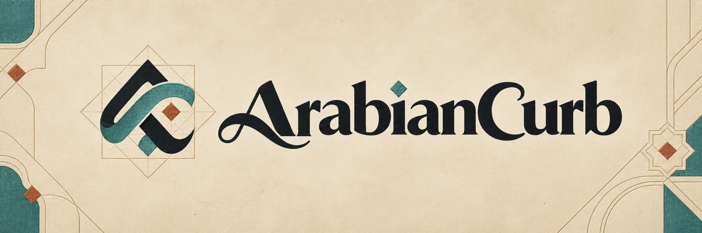

<div align="center">
  
</div>

<br />

<div align="center">
  <a href="https://github.com/loayabdalslam/ArabianCurb/stargazers"></a>
  <a href="https://www.npmjs.com/package/arabiancurb"></a>
  <a href="https://github.com/loayabdalslam/ArabianCurb/blob/main/LICENSE"></a>
  
  
</div>

<br />

# ArabianCurb

**ArabianCurb is an Arabic-first, RTL-aware extension of the VibeCurb anti-slop design system.** It gives AI coding and image-generation agents strict, research-backed rules for creating premium Arabic and bilingual digital experiences without falling into generic “Middle Eastern” visual clichés.

**ArabianCurb هو نظام Skills لتصميم وتوليد واجهات عربية احترافية.** يضيف دعمًا حقيقيًا لاتجاه RTL، الخطوط العربية، المحتوى ثنائي اللغة، الزخارف الإسلامية، الهوية الفرعونية والنيلية، ثقافة الصحراء والسدو، وتوليد الصور والـBrand Kits بطابع عربي مدروس.

> [!IMPORTANT]
> Arabic Mode is not a layout mirror or a decorative skin. It changes typography, directionality, mixed-script behavior, component flow, motion, image direction, cultural sourcing, and the final quality checks.

---

## لماذا ArabianCurb؟

أغلب نماذج الذكاء الاصطناعي تتعامل مع التصميم العربي بإحدى طريقتين ضعيفتين: قلب التصميم من اليسار إلى اليمين، أو إضافة قبة وفانوس ونقشة هندسية فوق تصميم غربي جاهز.

ArabianCurb يفرض نظامًا أدق:

- اتجاه RTL صحيح على مستوى HTML وCSS وليس محاذاة نص فقط.
- معالجة النصوص المختلطة مثل العربية مع الأسعار، الأرقام، البريد الإلكتروني والروابط.
- اختيار الخط العربي حسب الوظيفة: Display أو Body أو UI أو Calligraphic accent.
- فصل واضح بين الطابع الإسلامي، الفرعوني، الصحراوي والعربي المعاصر.
- استخدام النقوش كجزء من التكوين والـgrid بدل لصقها كخلفية جاهزة.
- حماية من الحروف العربية المفككة، النصوص الوهمية، والعبارات الدينية غير الموثقة.
- Quality Gates للغة، الثقافة، الوصولية، الأداء والموبايل.

---

## Arabic Mode at a glance

Every skill can activate Arabic Mode when the request includes Arabic, RTL, bilingual Arabic/Latin content, or a culturally grounded Arab-region direction.

The mode begins by locking six decisions:

| Decision | Available directions |
| :--- | :--- |
| Language | Arabic-first, Arabic-only, or bilingual |
| Locale | Country/region and language register |
| Direction | RTL base with controlled LTR islands |
| Heritage lane | Contemporary Arabic, Islamic, Pharaonic/Nile, or desert/Al Sadu |
| Intensity | Trace, accent, or immersive |
| Cultural source | A named place, period, craft, archive, object, or brand guideline |

If the request only says “make it Arabic,” the safe default is Modern Standard Arabic, Arabic-first RTL, contemporary Arabic art direction, and low ornament intensity. The system never invents a dynasty, country, religious context, or folk tradition.

---

## The four art-direction lanes

### 1. Contemporary Arabic

For technology, finance, mobility, fashion, media and modern institutions. Arabic typography carries the identity, supported by one local signal such as photography, material, architectural proportion, map geometry or a custom wordmark rhythm.

It explicitly rejects gold-on-black luxury defaults, neon “future Arabia,” and geometric patterns on every card.

### 2. Islamic geometry and arabesque

Uses a real construction system based on circles, squares, star grids, polygons, interlace, vegetal arabesque or verified calligraphy.

- One grid family per visual system.
- Pattern used as structure, aperture, divider, mask or shadow.
- No random scattering of stars and diamonds.
- No fabricated Qur'anic verses or pseudo-Arabic.
- Regional sources such as Maghrebi zellij, Mamluk stonework and Gulf screens are not treated as interchangeable skins.

### 3. Pharaonic and Nile

Builds from sourced visual principles such as lotus and papyrus forms, axial symmetry, carved registers, monumental flat planes, mineral pigments, sandstone and shallow relief.

It avoids the tourist bundle of pyramids, Tutankhamun masks, scarabs and sphinx silhouettes. Hieroglyphs must come from a documented source and must never be presented as a translation when they are only abstract decoration.

### 4. Desert and Al Sadu

Uses woven bands, stepped diamonds, triangles, wool fibers, long horizons, shade, stone, palm fiber and desert light behavior. The historical Al Sadu palette starts from black, white, brown, beige and red.

Al Sadu is treated as living Bedouin cultural heritage, not a generic “tribal” pattern. Gulf, Nubian, Amazigh, Levantine and North African crafts are never collapsed into one style.

---

## The seven skills

| Skill | Category | Standard capability | Arabic Mode extension |
| :--- | :--- | :--- | :--- |
| `awwwards-hero` | Frontend | Award-quality hero sections | Six Arabic hero architectures, RTL composition and Arabic display typography |
| `awwwards-sections` | Frontend | Premium below-the-fold sections | Arabic navigation, stats, timelines, forms, tables, locale switching and footer rules |
| `awwwards-motion` | Motion | Scroll, entry and interaction choreography | Joined-word reveals, locale-correct direction and motif-derived motion |
| `pixel-perfect` | Frontend | Screenshot-to-code replication | Arabic font, numeral, bidi-island and motif-source extraction |
| `visual-redesign` | Redesign | Non-destructive visual upgrade | RTL conversion with logical CSS while preserving application logic and data order |
| `imagegen-frontend` | Image generation | Website mockups and section references | Arabic-first image prompts, RTL compositions and culturally sourced materials |
| `brandkit-gen` | Image generation | Brand boards and identity systems | Arabic/Latin lockups, Arabic logo review and verified RTL applications |

Each skill contains its own `references/arabic-mode.md`, so it remains complete when installed independently.

---

## Arabic typography

Arabic is not Latin text mirrored. Connected shaping, diacritics, dots, word silhouettes and vertical proportions need a dedicated typography pass.

| Role | Direction | Suggested starting families |
| :--- | :--- | :--- |
| Display / Hero | Contemporary Kufi or expressive Arabic display | Noto Kufi Arabic, IBM Plex Sans Arabic, Changa, El Messiri, Reem Kufi |
| Body / Editorial | Naskh or readable Arabic sans | Noto Naskh Arabic, Amiri, IBM Plex Sans Arabic, Noto Sans Arabic |
| Product UI / Data | Compact screen-oriented Arabic sans | Noto Sans Arabic, IBM Plex Sans Arabic, Cairo, Tajawal |
| Heritage accent | Ruq'ah, calligraphy or commissioned lettering | Short verified phrases only |

Arabic Mode checks:

- Joining at every used weight.
- Diacritics and vertical clipping.
- Arabic and Latin punctuation.
- Arabic-Indic versus Latin numeral policy.
- Meaning-aware heading wrapping.
- Visual pairing between Arabic and Latin families.
- Font licensing, loading and fallback behavior.

---

## RTL engineering

The system uses semantic direction in markup and logical CSS properties:

```html
<html lang="ar" dir="rtl">
  <body>
    <p>ابدأ تجربتك <bdi lang="en">ArabianCurb</bdi></p>
    <p>السعر <bdi dir="ltr">SAR 1,250</bdi></p>
    <input dir="auto" name="message" />
  </body>
</html>
```

```css
.card {
  padding-inline: clamp(1rem, 3vw, 2rem);
  border-inline-start: 1px solid var(--border);
  text-align: start;
}

.icon-label { margin-inline-start: 0.75rem; }
.drawer { inset-inline-end: 0; }
```

The skills prohibit manually reversing strings, arrays, chronological data or DOM order to imitate RTL.

---

## Arabic image generation

Image generation remains a first-class capability in `imagegen-frontend` and `brandkit-gen`.

Arabic Mode adds:

- Arabic-first and RTL composition instructions.
- A named cultural source and heritage lane.
- Materials, pattern construction, palette and focal-device rules.
- Clean live-text zones when the image model cannot render Arabic accurately.
- Negative prompts against pseudo-Arabic, sacred text, generic lanterns and mixed-civilization collages.
- Separate output rules: one horizontal image per website section and one composed board per brand-kit request.

Example image prompt:

```text
Use imagegen-frontend with Arabic Mode.

Generate an Arabic-first RTL hero reference for a contemporary Egyptian
cultural platform. Use a Pharaonic/Nile direction at accent intensity,
based on lotus and papyrus relief rather than pyramid imagery.

Create one focal device: a monumental Arabic typographic composition
cut through shallow limestone relief. Use sandstone, mineral blue,
carbon black and restrained gold. Keep a clean live-text zone.

Exclude pseudo-Arabic, unreadable generated copy, sacred phrases,
tourist icon bundles, neon colors and mixed Islamic/desert motifs.
```

> [!NOTE]
> The skills direct the image-generation capability available in Codex, ChatGPT or the host agent. They do not bundle a separate image model inside this repository.

---

## Installation

### Run with npx

After the first npm release, no local installation is required:

```bash
npx arabiancurb
```

The default command opens the interactive installer. Selected skills are
copied to `.agents/skills/` in the current project.

### CLI commands

```bash
# List all seven skills
npx arabiancurb list

# Install one skill
npx arabiancurb add awwwards-hero

# Install multiple skills
npx arabiancurb add awwwards-hero awwwards-motion

# Install every skill
npx arabiancurb add --all

# Choose another skill root
npx arabiancurb add visual-redesign --target .cursor/skills

# Preview without writing files
npx arabiancurb add --all --dry-run

# Help and version
npx arabiancurb --help
npx arabiancurb --version
```

`install` is an alias for `add`, and `ls` is an alias for `list`.

### Global installation

```bash
npm install --global arabiancurb
arabiancurb list
arabiancurb add --all
```

### Run from source

Clone the repository and run the included CLI:

```bash
git clone https://github.com/loayabdalslam/ArabianCurb.git
cd ArabianCurb
npm install
npm start
```

### Manual installation

Copy the complete skill directory, not only `SKILL.md`:

```text
skills/awwwards-hero/
skills/awwwards-sections/
skills/awwwards-motion/
skills/pixel-perfect/
skills/visual-redesign/
skills/imagegen-frontend/
skills/brandkit-gen/
```

Place the selected directory under `.agents/skills/` or the equivalent skill directory supported by your agent.

### Installed package structure

The CLI copies each complete skill package, including the conditional Arabic
Mode reference:

```text
.agents/skills/<skill-name>/
├── SKILL.md
└── references/
    └── arabic-mode.md
```

---

## Publishing to npm

The npm package name and executable are both `arabiancurb`. The package uses a
strict `files` allowlist, runs syntax checks and tests during `prepack`, and
publishes as a public package.

### Local maintainer release

```bash
# Authenticate and confirm the active npm account
npm login
npm whoami

# Verify the exact tarball contents and run all prepack checks
npm pack --dry-run

# Publish the current version
npm publish --access public
```

Before a later release, update the version with one of:

```bash
npm version patch
npm version minor
npm version major
```

The package has a custom source-available license. Publishing confirms that
the maintainer intends to distribute it under the terms in `LICENSE`; it must
not be labeled as MIT-only or OSI-approved open source.

### GitHub release workflow

The repository includes `.github/workflows/publish.yml`. Publishing a GitHub
Release runs `npm ci`, the test suite, and `npm publish --provenance`. Add an
automation token as the `NPM_TOKEN` repository secret before using the
workflow.

---

## Usage

Mention the task, language mode, locale, heritage direction and intensity.

### Arabic hero

```text
Use awwwards-hero in Arabic Mode.
Build an Arabic-first RTL hero for a Saudi cultural archive.
Use Modern Standard Arabic and desert/Al Sadu art direction at accent intensity.
The design should feel editorial and contemporary, not folkloric.
```

### Bilingual landing page

```text
Use awwwards-hero and awwwards-sections in Arabic Mode.
Create a bilingual Arabic/English landing page for an Egyptian architecture studio.
Arabic owns the visual hierarchy. Use a locale switch instead of duplicated paragraphs.
Apply a contemporary Arabic direction with a trace of Nile materiality.
```

### Existing React redesign

```text
Use visual-redesign in Arabic Mode.
Upgrade this React application to support RTL without changing state,
API calls, routing, event handlers, validation or data ordering.
Replace physical directional CSS with logical properties and verify mixed bidi strings.
```

### Arabic brand system

```text
Use brandkit-gen in Arabic Mode.
Generate one identity board for a Gulf hospitality brand with an Arabic/Latin lockup.
Use Al Sadu only as a structural band system at trace intensity.
Avoid crescents, domes, camels and generic gold-on-black luxury.
```

---

## Quality gates

Arabic Mode is not complete until all applicable checks pass:

- Correct root `lang` and `dir`.
- Correct mixed Arabic/Latin strings, numbers, prices, dates, URLs and phone numbers.
- Semantic DOM, keyboard and focus order.
- Logical directional CSS.
- Correct Arabic shaping, punctuation, diacritics and line boxes.
- Responsive checks on mobile, tablet, desktop and 200% text zoom.
- One identifiable primary heritage lane.
- A named source for historical motifs.
- No sacred or unverified text used as decoration.
- No accidental mirroring of logos or universal icons.
- Reduced-motion and performance checks.
- Readable text when ornament is disabled.
---

## Original VibeCurb workflow

ArabianCurb preserves the original strict design pipeline:

1. **Design Read:** Extract typography, color, spacing, layout, atmosphere and cultural signals.
2. **Quality Gate:** Prove the direction before generating code or images.
3. **Precise Build:** Implement the selected architecture without drifting into generic defaults.
4. **Visual Diff:** Verify composition, type, color, motion, responsiveness and Arabic-specific behavior.
5. **Drift Rejection:** Reject AI-purple gradients, generic layouts, weak typography and cultural clichés.

This repository extends the original [VibeCurb project](https://github.com/Yu-369/VibeCurb) with a complete conditional Arabic design system.

---

## Contributing

Contributions are welcome, especially:

- Arabic typography and font-pairing improvements.
- Country- and region-specific design references.
- Accessibility and bidi test cases.
- Verified cultural sources and motif corrections.
- Real examples produced with the skills.

Please avoid adding unsourced motif meanings, fabricated Arabic phrases or rules that collapse distinct Arab and neighboring cultures into one visual style.

---

## License

ArabianCurb-specific additions are distributed under the custom
**ArabianCurb Source-Available License v1.0 with Commercial Website Sale
Royalty**. If the Tool materially assists a website that is later sold, the
license requires a royalty equal to **10% of the Gross Website Sale Price**,
administered through professional honesty and voluntary self-reporting without
telemetry or routine audit rights.

The original upstream VibeCurb materials remain under their original MIT
License. Read the complete terms, definitions, payment timing, attribution,
and contact details in [LICENSE](LICENSE) before commercial use.

Licensing contact: [loaiabdalslam@gmail.com](mailto:loaiabdalslam@gmail.com),
or Loay Abdalslam through LinkedIn or Facebook.

> **ملخص عربي غير حاكم:** استخدام إضافات ArabianCurb في إنشاء موقع يتم بيعه
> مستقبلًا يستلزم دفع نسبة 10% من إجمالي سعر بيع الموقع إلى لؤي عبد السلام.
> تعتمد العملية على الأمانة المهنية والإبلاغ الطوعي، دون Telemetry أو حق تدقيق
> روتيني. النص الإنجليزي الكامل داخل `LICENSE` هو النص الحاكم عند الاختلاف.
